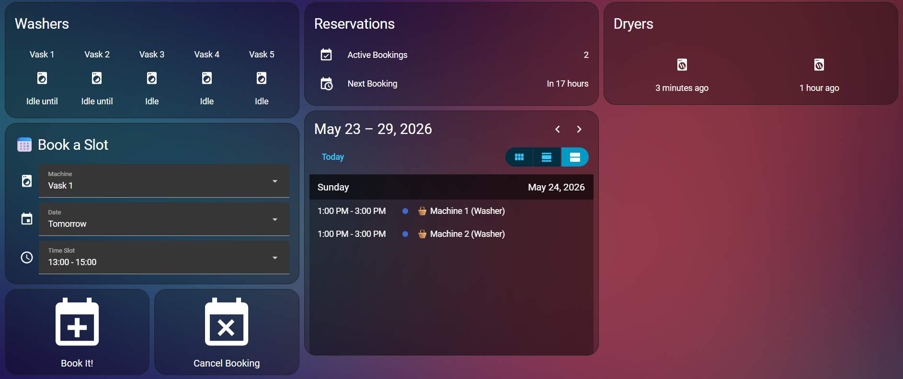

# MieleLogic - Home Assistant Integration

Custom Home Assistant integration for **MieleLogic** communal laundry booking systems used in Europe.

Book and manage washing machine reservations directly from your Home Assistant dashboard.



## Features

- **Live machine status** - see which washers/dryers are idle, busy, or running
- **Calendar entity** - your reservations show up in the HA calendar
- **Book & cancel** - tap a machine, pick a date and available time slot, hit Book
- **Dynamic time slots** - dropdown only shows slots that are actually available on the website
- **Services for automations** - `create_reservation`, `cancel_reservation`, `update_available_slots`


## Installation

### 1. Copy the integration

Copy the `custom_components/mielelogic/` folder into your Home Assistant config directory:

```
config/
  custom_components/
    mielelogic/
      __init__.py
      api.py
      calendar.py
      config_flow.py
      const.py
      coordinator.py
      manifest.json
      sensor.py
      services.yaml
      strings.json
      translations/
        en.json
```

### 2. Add helper entities

Copy `hass_config/input_select_laundry.yaml` to your config directory and add to `configuration.yaml`:

```yaml
input_select: !include input_select_laundry.yaml
```

> **Note:** Edit `input_select_laundry.yaml` to match your laundry's machine names if they differ from "Vask 1-5".

### 3. Add booking scripts

Append the contents of `hass_config/scripts_laundry.yaml` to your `scripts.yaml`.

> **Note:** Edit the `machine_map` in the scripts if your machines have different names/numbers.

### 4. Add the automation

Append the contents of `hass_config/automation_laundry.yaml` to your `automations.yaml`. This makes the time slot dropdown update automatically when you change the machine or date.

### 5. Restart Home Assistant

### 6. Add the integration

Go to **Settings > Devices & Services > Add Integration** and search for **Miele Logic Laundry**.

Enter your MieleLogic credentials:
- **Card/User number** - the number you use to log in at mielelogic.com
- **Password** - your password
- **Country** - select your country

### 7. Add the dashboard

Edit your Lovelace dashboard and add the view from `hass_config/lovelace_laundry_view.yaml`.

> **Note:** Update the entity IDs if your laundry number differs from 4557.

## Entities Created

| Entity | Type | Description |
|--------|------|-------------|
| `sensor.laundry_XXXX_maskine_N` | Sensor | Per-machine status (Idle/Busy) with attributes |
| `sensor.laundry_XXXX_reservations` | Sensor | Number of active reservations |
| `sensor.laundry_XXXX_next_reservation` | Sensor | Timestamp of next booking |
| `calendar.laundry_XXXX_laundry_bookings` | Calendar | Reservations in calendar view |

## Services

### `mielelogic.create_reservation`
Book a time slot.
```yaml
service: mielelogic.create_reservation
data:
  machine_number: 1
  start: "2026-05-24T09:00:00"
  end: "2026-05-24T11:00:00"
```

### `mielelogic.cancel_reservation`
Cancel a booking.
```yaml
service: mielelogic.cancel_reservation
data:
  machine_number: 1
  start: "2026-05-24T09:00:00"
  end: "2026-05-24T11:00:00"
```

### `mielelogic.update_available_slots`
Refresh the time slot dropdown based on current machine/date selection. Called automatically by the included automation.

## Standalone Python Library

`mielelogic.py` is a standalone Python client that works independently of Home Assistant:

```python
from mielelogic import MieleLogic

client = MieleLogic("your_card_number", "your_password", "dk")

# Check machine status
for m in client.get_machine_states():
    print(f"{m.name}: {m.status_text}")

# See available slots
for s in client.get_available_slots():
    print(f"{s.machine_name}: {s.start} - {s.end}")

# Book a slot
client.create_reservation(machine_number=1, start=slot.start, end=slot.end)
```


## License

MIT
